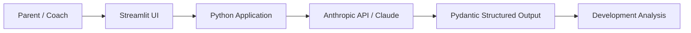

# Youth Development Coach

An AI-powered youth sports development tool that turns parent and coach observations into structured, evidence-aware development guidance.

Rather than jumping from a single observation to a diagnosis, the system separates observed facts from inference, maintains competing hypotheses, communicates uncertainty, and identifies what evidence to collect next.

## Product Demo

### 1. Add Athlete Context

### 2. Capture a Game or Practice Observation

### 3. Generate Evidence-Aware Development Guidance

## Why I Built It

Parents and youth coaches often recognize that something changed in an athlete's performance without having enough evidence to know why.

A traditional chatbot can provide immediate advice, but it may also confidently diagnose a mechanical or mental issue from very limited information.

Youth Development Coach explores a different AI product pattern:

**Observe → Hypothesize → Test → Learn over time**

## Current Prototype — v0.1

Users provide:

- Athlete age and sport
- Optional team and position context
- Game or practice context
- A natural-language observation

The application returns:

- Observed facts
- Competing explanations
- Confidence levels
- Development priorities
- Practice recommendations
- Coaching cues
- Evidence to track next

The same reasoning architecture has been tested across baseball and tennis without sport-specific application logic.

## AI Product Architecture

The application uses a defined data contract rather than displaying unrestricted model prose. Observations, hypotheses, development priorities, recommendations, coaching cues, and tracking items are represented as structured objects with stable IDs and relationships.

## AI Reliability

The prototype is intentionally designed around uncertainty and evidence quality.

Current evaluation areas include:

- Separating observation from inference
- Preventing unsupported mechanical diagnoses
- Calibrating confidence to available evidence
- Preserving competing hypotheses
- Avoiding invented measurements or training quantities
- Preventing subjective observations from becoming objective-sounding facts
- Matching recommendations to the strength of available evidence

Early model failures are being retained as evaluation cases rather than solved only through ad hoc prompt tuning.

## Tech Stack

- Python
- Streamlit
- Anthropic API
- Claude
- Pydantic
- Google Colab
- GitHub

## Roadmap

### v0.2 — Longitudinal Athlete History
Store athlete sessions and use accumulated evidence to strengthen, weaken, or preserve hypotheses over time.

### v0.3 — Evaluation Framework
Create reusable test cases and regression evaluations for reasoning quality and model reliability.

### v0.4 — Multimodal Evidence
Use video or image analysis as an additional source of structured observations.

### v1.0 — Portfolio-Ready Product
Refined UX, persistent data, formal evaluations, deployment, documentation, and product case study.

## Documentation

See [`docs/PRD.md`](docs/PRD.md) for the full product requirements document.

---

**Status:** v0.1 working prototype
