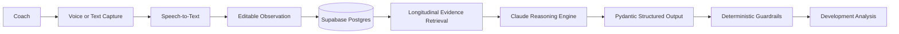
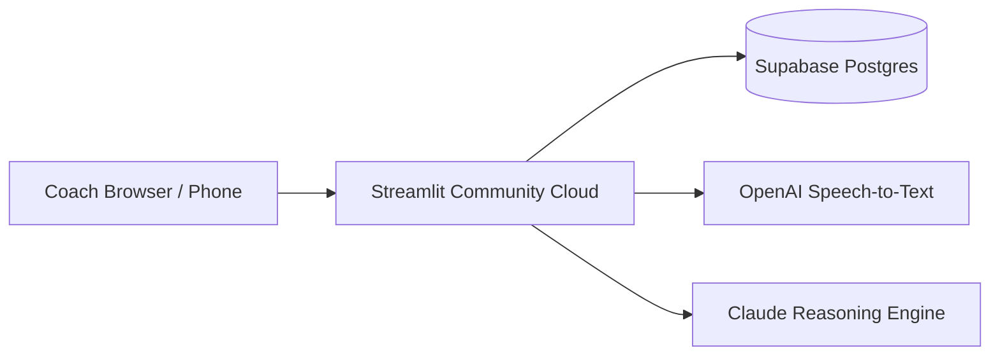

# Youth Development Coach

An AI-native youth sports development tool that helps coaches turn quick field observations into structured, evidence-aware athlete development guidance that improves as evidence accumulates over time.

Rather than jumping from a single observation to a diagnosis, the system separates observed facts from inference, maintains competing hypotheses, communicates uncertainty, and identifies what evidence to collect next.

**Core product principle:**

> Observe first. Hypothesize second. Intervene carefully. Learn over time.

## Product Demo

### 1. Select or Create an Athlete

### 2. Capture an Observation

Coaches can record a voice note from the field or type an observation. Voice notes are transcribed into an editable draft before being saved as evidence.

### 3. Build a Longitudinal Athlete Record

Human-reported observations from games and practices accumulate in a persistent athlete history.

AI-generated hypotheses are kept distinct from human-reported evidence so prior model speculation does not recursively become accepted as fact.

### 4. Generate Evidence-Aware Development Guidance

The system reasons across the athlete's accumulated observation history to identify supported hypotheses, development priorities, low-risk practice recommendations, coaching cues, and evidence to track next.

## Why I Built It

Youth coaches and parents often recognize that something changed in an athlete's performance without having enough evidence to know why.

A traditional chatbot can immediately generate advice, but it may also confidently diagnose a mechanical, physical, or psychological issue from very limited information.

Youth Development Coach explores a different AI product pattern:

**Observe → Hypothesize → Test → Learn over time**

The goal is not to replace a coach. It is to help a coach maintain a better evidence trail, reason across observations over time, and avoid turning a plausible explanation into a premature conclusion.

## Current Prototype — v0.5

v0.5 moves the prototype from a local development environment to an independently deployed, persistent field-test application.

The application is deployed through Streamlit Community Cloud, uses Supabase Postgres for hosted athlete and observation persistence, and supports password-protected remote access.

The deployed workflow has been validated from a mobile browser, including voice capture, speech-to-text transcription, editable transcript review, and persistent observation storage.

### On-field capture

The coach can:

- Select or create an athlete
- Record a quick voice observation from a phone or browser
- Automatically transcribe the recording
- Review or edit the transcript
- Save the observation immediately
- Continue capturing additional observations without waiting for AI analysis

### Persistent athlete history

Athlete profiles and observations are stored in hosted Postgres rather than in the application runtime.

This allows athlete history to persist across application restarts and makes the field-test application usable remotely without requiring a development machine, Colab session, or temporary tunnel to remain active.

### Post-session reasoning

When ready, the coach can generate a Development Analysis across the athlete's saved observation history.

The application:

- Retrieves chronological human-reported observations
- Separates observed facts from inference
- Looks for repeated patterns and contradictory evidence
- Maintains competing hypotheses when evidence supports them
- Abstains from causal diagnosis when evidence does not support one
- Calibrates confidence to the available athlete-specific evidence
- Generates development priorities only when they trace to supported hypotheses
- Recommends low-risk next actions
- Identifies evidence that would help distinguish between explanations

The same core reasoning architecture has been tested with baseball and tennis examples without requiring sport-specific application logic.

## AI Product Architecture

### Deployment architecture

API credentials and database credentials are stored as server-side secrets rather than committed to the GitHub repository.

The field-test application also includes password-based access control before exposing athlete information or application functionality.

### Evidence and inference are intentionally separate

A key architectural principle is that **stored data is not automatically model context**.

The application explicitly controls which historical information is supplied to the model.

Human-reported observations can become evidence for future analysis. Previous AI-generated hypotheses are not automatically fed back as evidence.

This reduces the risk of model-generated speculation recursively becoming accepted as fact.

## Structured AI Output

The reasoning engine uses a defined data contract rather than unrestricted model prose.

Pydantic models represent:

- Observations
- Hypotheses
- Evidence supporting each hypothesis
- Missing evidence
- Confidence
- Development priorities
- Practice recommendations
- Coaching cues
- Tracking items
- Overall confidence and rationale

Stable IDs connect hypotheses to evidence and downstream recommendations.

Structured output guarantees the **shape** of the response—not its **truth**. Reasoning quality therefore requires separate evaluation.

## Evaluation & AI Reliability

v0.3 introduced a reusable evaluation framework for reasoning quality.

Evaluation cases test behaviors such as:

- Separating observation from inference
- Preventing unsupported mechanical diagnoses
- Preventing unsupported psychological diagnoses
- Grounding hypotheses in athlete-specific evidence
- Calibrating confidence to available evidence
- Preserving contradictory evidence
- Preserving provenance of subjective reports
- Avoiding invented measurements, repetitions, or history
- Requesting discriminating evidence
- Preventing unsupported hypotheses from becoming development prescriptions

The evaluation harness uses structured PASS/FAIL criteria and an LLM judge to provide repeatable regression testing while recognizing that an LLM judge is not ground truth.

Early model failures were retained as evaluation cases rather than addressed only through ad hoc prompt tuning.

## Deterministic Reasoning Guardrail

Prompt instructions alone were not sufficient to enforce every product invariant.

The application therefore includes a deterministic post-processing guardrail:

**A causal development priority cannot exist unless it traces back to an evidence-supported hypothesis.**

Recommendations and coaching cues must similarly trace to valid development priorities.

This creates a structural backstop when probabilistic model behavior does not fully follow the reasoning policy.

## Key Product Decisions

### Capture first, analyze later

The first prototype analyzed every observation immediately.

That interaction was poorly suited to an actual coach on the field.

v0.4 separated the workflow:

**Select athlete → Speak → Review transcript → Save evidence**

from:

**Review accumulated evidence → Generate Development Analysis**

This keeps capture fast and prevents AI latency from interrupting coaching.

### Persistence belongs outside the application runtime

The original prototype stored athlete history in SQLite during development.

v0.5 moves persistence to hosted Postgres so the athlete's longitudinal record is independent of the Streamlit process, Colab runtime, and developer machine.

This makes remote field testing possible while preserving the existing evidence model.

### Human evidence ≠ AI inference

Previous model hypotheses are never treated as new athlete evidence simply because the model generated them earlier.

### Abstention is a valid output

If the evidence establishes what happened but not why it happened, the system can return no causal hypothesis rather than inventing one to fill the schema.

### Uncertainty must propagate

A low-confidence hypothesis should not become a high-confidence training prescription downstream.

The system therefore treats uncertainty as an architectural concern, not merely a confidence label displayed to the user.

## Tech Stack

- Python
- Streamlit
- Streamlit Community Cloud
- Supabase Postgres
- Anthropic API / Claude
- OpenAI speech-to-text
- Pydantic
- GitHub
- Google Colab and Google Drive for development

## Development Progress

### v0.1 — Structured Reasoning — Complete
Structured, evidence-aware analysis of individual athlete observations.

### v0.2 — Longitudinal Athlete History — Complete
Persistent athlete profiles, dated session history, temporal evidence retrieval, and longitudinal reasoning.

### v0.3 — Evaluation & Reasoning Guardrails — Complete
Reusable behavioral evaluations, stricter evidence-grounding rules, uncertainty propagation, provenance handling, and deterministic guardrails.

### v0.4 — Voice-First Evidence Capture — Complete
On-field audio capture, speech-to-text transcription, editable review, rapid evidence persistence, and post-session longitudinal analysis.

### v0.5 — Independent Deployment — Complete
Migrated persistence from local SQLite to hosted Supabase Postgres, deployed the application independently through Streamlit Community Cloud, moved credentials to server-side secrets, added field-test access control, and validated the complete voice-to-persistent-evidence workflow from a mobile browser.

## Future Exploration

### Coach Field Testing
Put the independently deployed application in the hands of a youth coach during real practices and games.

Evaluate:

- Whether voice capture is fast and unobtrusive enough during coaching
- When observations are actually recorded
- Whether coaches review Development Analysis during or after sessions
- Which recommendations and tracking prompts are useful
- Where the workflow creates friction
- Which evidence sources coaches naturally want to add

### Structured Game Evidence
Add scorecards, box scores, and similar game records as distinct evidence sources with explicit provenance.

A likely workflow is:

**Upload game record → Extract structured evidence → Human review/correction → Save verified evidence → Longitudinal reasoning**

The goal is not to treat model extraction as ground truth. Extracted performance data should remain reviewable and distinguishable from coach observations and AI-generated hypotheses.

### Multimodal Evidence
Explore video as another evidence source rather than as an automatic diagnosis engine:

**Video → Events → Structured Observations → Human Review → Longitudinal Reasoning**

A related tennis prototype can test whether whole-match video provides useful evidence that complements the reasoning architecture developed here.

### Curated Coaching Knowledge
Separate athlete-specific reasoning from retrieval of vetted coaching guidance so recommendations can incorporate age-, sport-, and topic-appropriate knowledge without confusing general coaching guidance with evidence about a specific athlete.

### Production Identity & Authorization
The current password gate is appropriate for limited field testing but is not intended to be a full production identity system.

Future versions can introduce individual user accounts, team-level authorization, and stronger access controls if broader use warrants them.

## What This Project Explores

Youth Development Coach is primarily an exploration of AI product design rather than a claim that an LLM can diagnose athlete performance.

The project focuses on:

- Human-in-the-loop AI workflows
- Evidence provenance
- Longitudinal reasoning
- Structured model outputs
- Uncertainty-aware UX
- LLM evaluation
- Deterministic guardrails around probabilistic systems
- Voice as a low-friction field interface
- Persistent cloud-backed evidence
- Designing AI to support expert judgment rather than replace it

## Documentation

See [`docs/PRD.md`](docs/PRD.md) for the product requirements document.

---

**Status:** v0.5 independently deployed field-test prototype — mobile voice capture, persistent Supabase athlete history, longitudinal AI reasoning, evaluation framework, deterministic reasoning guardrails, and password-protected remote access.
