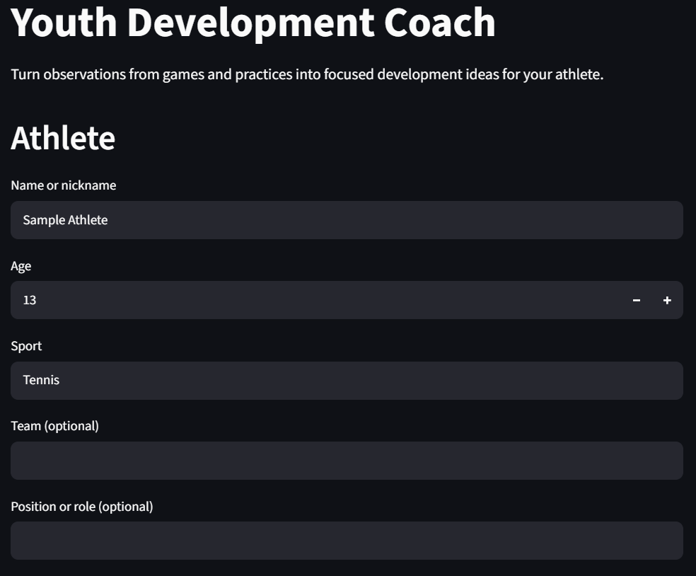
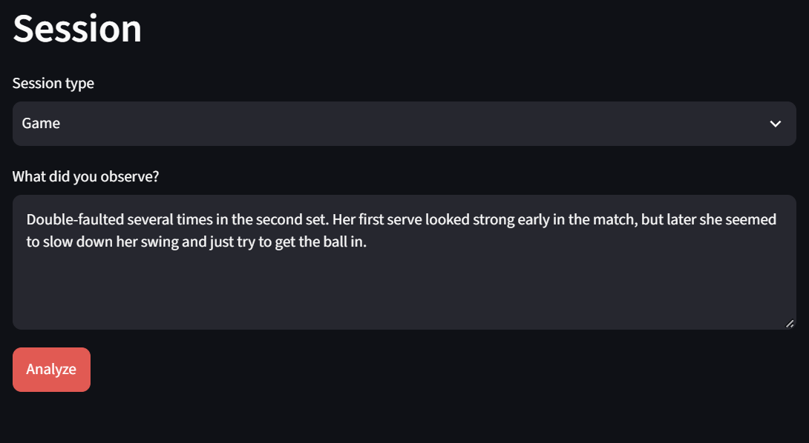
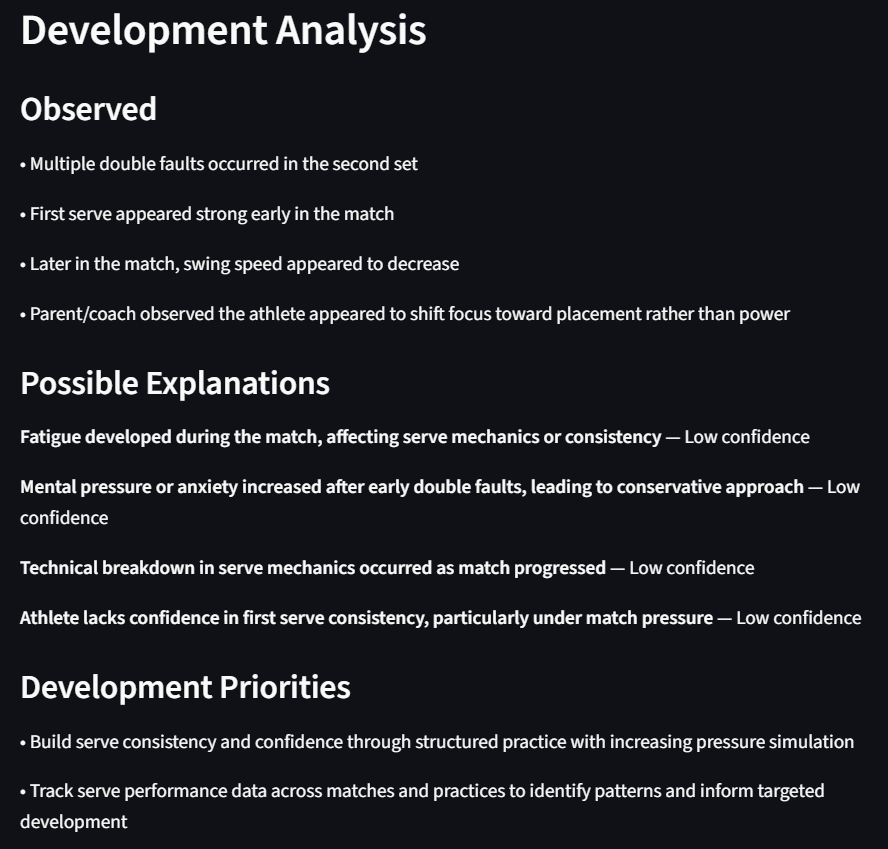
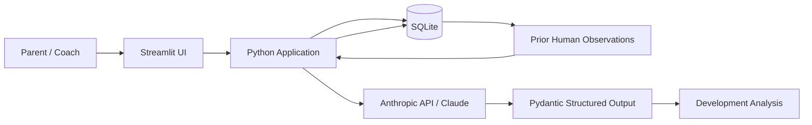

# Youth Development Coach

An AI-powered youth sports development tool that turns parent and coach observations into structured, evidence-aware development guidance that can improve as evidence accumulates over time.

Rather than jumping from a single observation to a diagnosis, the system separates observed facts from inference, maintains competing hypotheses, communicates uncertainty, and identifies what evidence to collect next.

## Product Demo

### 1. Select or Create an Athlete

### 2. Capture a Game or Practice Observation

### 3. Generate Evidence-Aware Development Guidance

## Why I Built It

Parents and youth coaches often recognize that something changed in an athlete's performance without having enough evidence to know why.

A traditional chatbot can provide immediate advice, but it may also confidently diagnose a mechanical or mental issue from very limited information.

Youth Development Coach explores a different AI product pattern:

**Observe → Hypothesize → Test → Learn over time**

## Current Prototype — v0.2

The prototype now maintains persistent athlete profiles and dated session history.

For each game or practice, users provide:

- Athlete context
- Session date and type
- A natural-language observation

The application:

- Retrieves relevant prior human-reported observations for that athlete
- Filters historical evidence based on session date
- Provides that evidence to Claude as longitudinal context
- Separates observed facts from inference
- Maintains competing hypotheses and confidence levels
- Identifies development priorities and low-risk next actions
- Identifies evidence to track next
- Stores the new human observation and structured AI analysis separately
- Displays persistent session history in the UI

The same reasoning architecture has been tested across baseball and tennis without sport-specific application logic.

## AI Product Architecture

A key architectural principle is that **stored data is not automatically model context**.

The application controls which historical information is supplied to the model. Prior human-reported observations can become evidence for future analysis, while previous AI-generated hypotheses are stored separately and are not automatically treated as evidence.

This reduces the risk of model-generated speculation recursively becoming accepted as fact.

## Structured AI Output

The application uses a defined data contract rather than displaying unrestricted model prose.

Observations, hypotheses, development priorities, recommendations, coaching cues, and tracking items are represented as structured objects with stable IDs and relationships using Pydantic.

Structured output guarantees the **shape** of the response—not its **truth**. Reasoning quality therefore requires separate evaluation.

## AI Reliability

The prototype is intentionally designed around uncertainty, provenance, and evidence quality.

Current evaluation areas include:

- Separating observation from inference
- Preventing unsupported mechanical diagnoses
- Calibrating confidence to available evidence
- Preserving competing hypotheses
- Handling contradictory historical evidence
- Avoiding invented measurements or training quantities
- Preventing subjective observations from becoming objective-sounding facts
- Preventing previous AI hypotheses from becoming future evidence
- Matching recommendations to the strength of available evidence

Early model failures are being retained as evaluation cases rather than solved only through ad hoc prompt tuning.

## Tech Stack

- Python
- Streamlit
- Anthropic API / Claude
- Pydantic
- SQLite
- Google Colab
- Google Drive
- GitHub

## Roadmap

### v0.1 — AI Reasoning Prototype — Complete
Structured, evidence-aware analysis of individual athlete observations.

### v0.2 — Athlete History & Longitudinal Reasoning — Complete
Persistent athlete profiles, dated session history, temporal evidence retrieval, and longitudinal AI context.

### v0.3 — Evaluation Framework — Next
Reusable test cases and regression evaluations for reasoning quality and model reliability.

### v0.4 — Multimodal Evidence
Use video or image analysis as an additional source of structured observations.

### v1.0 — Portfolio-Ready Product
Refined UX, production persistence, formal evaluations, deployment, documentation, and product case study.

## Documentation

See [`docs/PRD.md`](docs/PRD.md) for the canonical product requirements document.

---

**Status:** v0.2 longitudinal reasoning prototype complete; v0.3 evaluation framework next.
